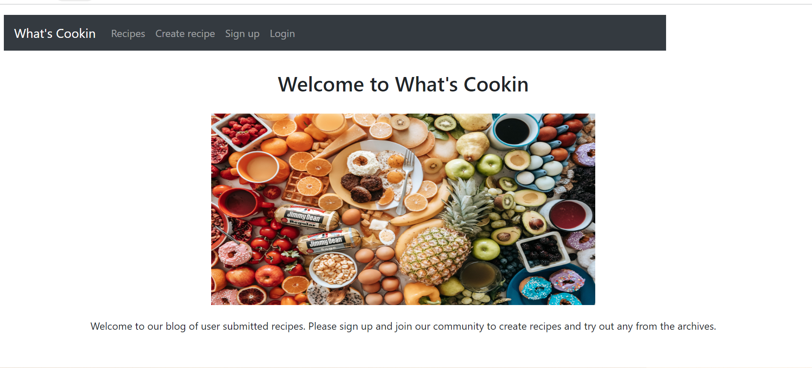
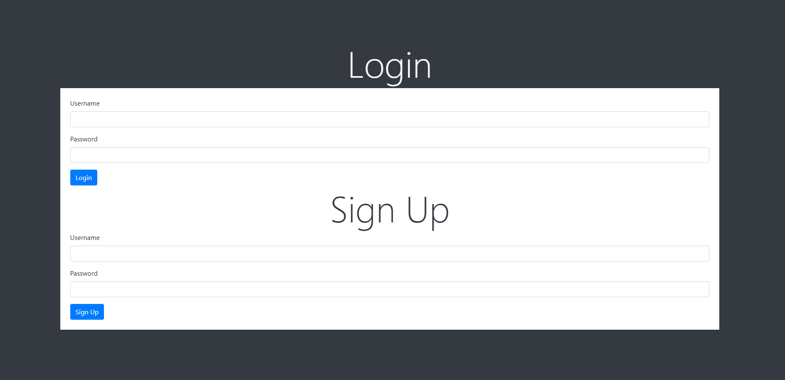
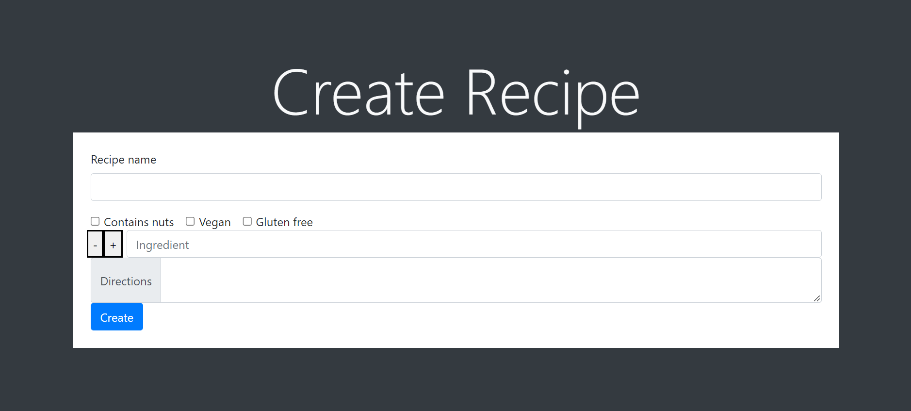

# What-s-Cooking

## DESCRIPTION

A blog that lets you enter a recipe and share it with other members who have signed up for the blog.

## MOTIVATION  

Making it easier to upload and find recipes

## INSTALLATION AND UPDATES MADE

HTML, CSS, JavaScript, Node.js, Express.js, Handlebars.js, Mysql, Sequelize

## USAGE

Add a recipe and save it to look at agian in the future

## Github

https://github.com/llyruss/What-s-Cookin

## URL  

https://whatscookin.herokuapp.com/

## COLLABORATORS

-Lily Russ
https://github.com/llyruss

-Jacob Schoenbauer  
 https://github.com/Jacobschoenbauer

-Deshawn Williams 

https://github.com/deshawnwilliams94

-Garrett Ohrt

https://github.com/garrettohrt

